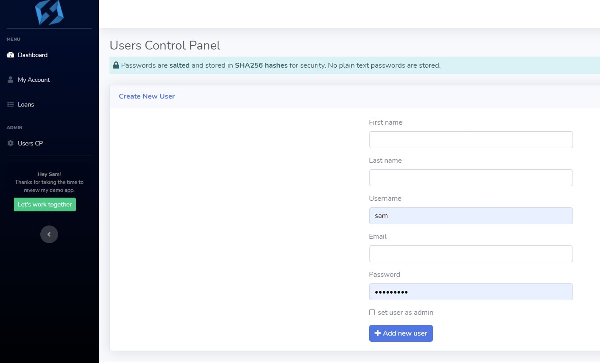

# Loan Demo

This is a MVC Node App demo of a simplified admin control panel to manage users and view loan applications that come from an independent landing page React App.   

---

## Server

Ubuntu cloud server is setup with with Nginx reverse proxy, PM2, Certbot and MongoDB.

## React App

React landing page demo uses React, React Bootstrap, localStorage to save the state of loan status and check until status changes from 'pending' to 'approved' or 'denied'. App uses Node/Express for the backend server requests to the control panel API.
- **Landing page:** [demolp.samhowell.dev](https://demolp.samhowell.dev/)

## Node App

Control panel demo is built with Node and structured in a MVC design pattern. It uses Express, EJS, Mongo, Passport, Boostrap, Nodemailer, restricted roles, API keys for integration with the React landing page app, and secure sha256 password storage.

- **Control panel:** [democp.samhowell.dev](https://democp.samhowell.dev/)
  - username: demo
  - password: demo

Users with an 'admin' role can add new users in the User CP. A registration email with user details is then sent via Nodemailer. 

